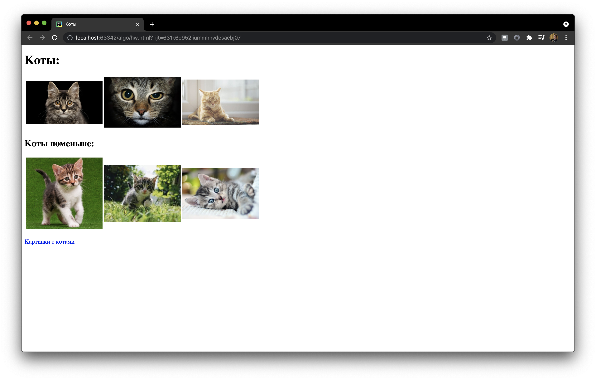

## Домашнее задание
Используя разные теги HTML, о которых было рассказано на занятии, сделайте такую страничку:

---
Решения и вопросы присылайте в телеграм. Пользоваться можно только теми 
средствами языка, о которых было рассказано на занятии.
